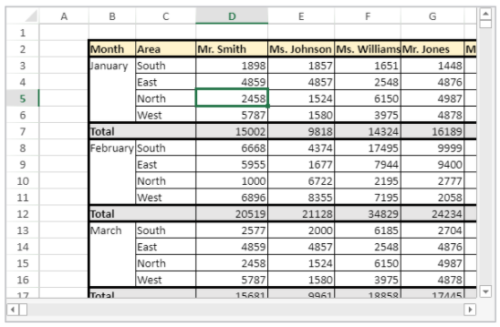

# VP Get active cell


**VP Get active cell** (  *vpAreaName* : Text { ; *sheet* : Integer } ) : Object


|Parameter|Type| |Description|
|---|---|---|---|
|vpAreaName  |Text|->|4D View Pro area form object name|
|sheet  |Integer|->|Sheet index (current sheet if omitted)|
|Result  |Object|<-|Range object of single cell|

## Description

The `VP Get active cell` command returns a new range object referencing the cell which has the focus and where new data will be entered (the active cell).

In *vpAreaName*, pass the name of the 4D View Pro area. If you pass a name that does not exist, an error is returned.

In the optional *sheet* parameter, you can designate a specific spreadsheet where the range will be defined (counting begins at 0). If omitted or if you pass `vk current sheet`, the current spreadsheet is used.

## Example



The following code will retrieve the coordinates of the active cell:

```4d
$activeCell:=VP Get active cell("myVPArea")
 
  //returns a range object containing: 
  //$activeCell.ranges[0].column=3
  //$activeCell.ranges[0].row=4
  //$activeCell.ranges[0].sheet=0
```

## See also

[VP ADD SELECTION](VP%20ADD%20SELECTION.md)<br/>
[VP Get selection](VP%20Get%20selection.md)<br/>
[VP RESET SELECTION](VP%20RESET%20SELECTION.md)<br/>
[VP SET ACTIVE CELL](VP%20SET%20ACTIVE%20CELL.md)<br/>
[VP SET SELECTION](VP%20SET%20SELECTION.md)<br/>
[VP SHOW CELL](VP%20SHOW%20CELL.md)