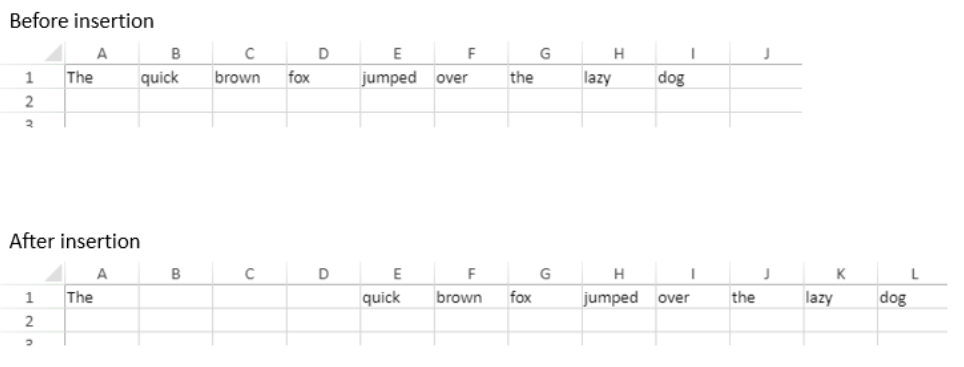

# VP INSERT COLUMNS


**VP INSERT COLUMNS** ( *rangeObj* : Object ) 


|Parameter|Type||Description|
|---|---|---|---|
|rangeObj   |Object|->|Range object|

## Description

The `VP INSERT COLUMNS` command inserts columns into the *rangeObj*.

In *rangeObj*, pass an object containing a range of the starting column (the column which designates where the new column will be inserted) and the number of columns to insert. If the number of column to insert is omitted (not defined), a single column is inserted.

New columns are inserted on the left, directly before the starting column in the *rangeObj*.

## Example

To insert three columns before the second column:

```4d
VP INSERT COLUMNS(VP Column("ViewProArea";1;3))
```

The results is:



## See also

[VP DELETE COLUMNS](VP%20DELETE%20COLUMNS.md)<br/>
[VP DELETE ROWS](VP%20DELETE%20ROWS.md)<br/>
[VP INSERT ROWS](VP%20INSERT%20ROWS.md)